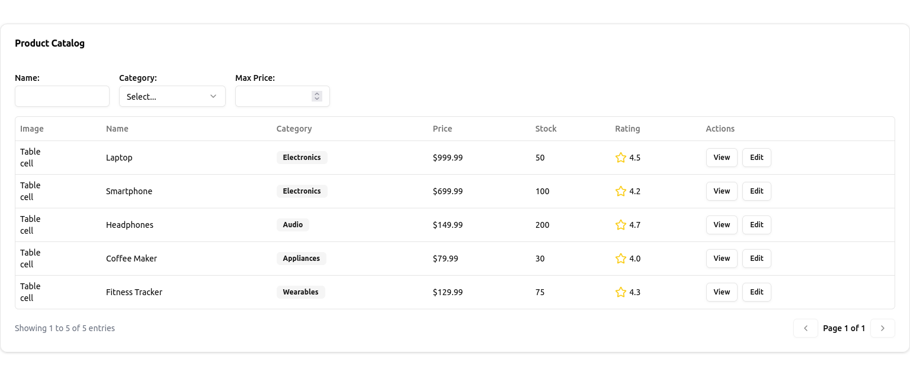

# merriamtables

## Dynamic Datatable Generator with shadcn/ui

The **Dynamic Datatable Generator** is a flexible and customizable React component built with **shadcn/ui** that allows you to create dynamic, sortable, filterable, and paginated tables with ease. It supports various column types (text, number, money, badge, icon, image, and actions) and provides a responsive design for both desktop and mobile views.

---

## Features

- **Dynamic Columns**: Define columns with different types (text, number, money, badge, icon, image, actions).
- **Sorting**: Sort data by clicking on column headers.
- **Filtering**: Apply filters using text inputs, dropdowns, or custom filter fields.
- **Pagination**: Navigate through large datasets with pagination.
- **Responsive Design**: Automatically switches to a mobile-friendly card view on smaller screens.
- **Custom Actions**: Add custom actions (e.g., View, Edit) to each row.
- **Customizable Styling**: Built with **shadcn/ui** for consistent and customizable styling.

---

## Installation

1. Install the required dependencies:
   ```bash
   npm install @radix-ui/react-select lucide-react
   ```

2. Ensure you have **shadcn/ui** set up in your project. If not, follow the [shadcn/ui installation guide](https://ui.shadcn.com/docs/installation).

3. Import the `DynamicDatatable` component into your project.

---

## Usage

### 1. Define Your Data and Columns

Define the data and columns for your table. Each column should specify:
- `header`: The column header text.
- `accessorKey`: The key to access the data in each row.
- `type`: The type of column (e.g., `text`, `number`, `money`, `badge`, `icon`, `image`, `actions`).
- `showOnMobile`: Whether the column should be visible in the mobile card view.

```typescript
interface Product {
  id: number;
  name: string;
  category: string;
  price: number;
  stock: number;
  rating: number;
  image: string;
}

const products: Product[] = [
  {
    id: 1,
    name: "Laptop",
    category: "Electronics",
    price: 999.99,
    stock: 50,
    rating: 4.5,
    image: "/placeholder.svg?height=40&width=40",
  },
  // Add more products...
];

const columns: ColumnDef<Product>[] = [
  { header: "Image", accessorKey: "image", type: "image", showOnMobile: true },
  { header: "Name", accessorKey: "name", type: "text", showOnMobile: true },
  { header: "Category", accessorKey: "category", type: "badge", showOnMobile: true },
  { header: "Price", accessorKey: "price", type: "money", showOnMobile: true },
  { header: "Stock", accessorKey: "stock", type: "number", showOnMobile: false },
  {
    header: "Rating",
    accessorKey: "rating",
    type: "icon",
    formatFn: (value: number) => (
      <div className="flex items-center">
        <Star className="w-5 h-5 text-yellow-400 mr-1" />
        {value.toFixed(1)}
      </div>
    ),
    showOnMobile: true,
  },
  { header: "Actions", accessorKey: "actions", type: "actions", showOnMobile: true },
];
```

### 2. Define Filter Fields and Actions

Define the filter fields and actions for your table:

```typescript
const filterFields: FilterField<Product>[] = [
  { key: "name", label: "Name", type: "text" },
  {
    key: "category",
    label: "Category",
    type: "select",
    options: ["Electronics", "Audio", "Appliances", "Wearables"],
  },
  { key: "price", label: "Max Price", type: "number" },
];

const actions: Action<Product>[] = [
  {
    label: "View",
    onClick: (product) => {
      console.log("Viewing product:", product);
      alert(`Viewing ${product.name}`);
    },
  },
  {
    label: "Edit",
    onClick: (product) => {
      console.log("Editing product:", product);
      alert(`Editing ${product.name}`);
    },
  },
];
```

### 3. Use the `DynamicDatatable` Component

Pass the data, columns, filter fields, and actions to the `DynamicDatatable` component:

```typescript
import { DynamicDatatable } from "@/components/dynamic-datatable";

export default function Example() {
  return (
    <div className="container mx-auto py-10">
      <DynamicDatatable<Product>
        data={products}
        columns={columns}
        filterFields={filterFields}
        actions={actions}
        title="Product Catalog"
      />
    </div>
  );
}
```

---

## Example Output

Here’s an example of what the table looks like:


---

## Props

### `DynamicDatatable<T>`

| Prop          | Type               | Description                                                                 |
|---------------|--------------------|-----------------------------------------------------------------------------|
| `data`        | `T[]`              | The data to display in the table.                                           |
| `columns`     | `ColumnDef<T>[]`   | The columns to display in the table.                                        |
| `filterFields`| `FilterField<T>[]` | The filter fields to display above the table.                               |
| `actions`     | `Action<T>[]`      | The actions to display in the "Actions" column.                             |
| `title`       | `string`           | The title to display at the top of the table.                               |

---

## Customization

You can customize the table by:
- Adding more column types.
- Customizing the filter fields.
- Adding more actions.
- Styling the table using **shadcn/ui** components.

---

## Contributing

Contributions are welcome! Please open an issue or submit a pull request for any improvements or bug fixes.

---

## License

This project is licensed under the MIT License. See the [LICENSE](./LICENSE) file for details.

---

Enjoy building dynamic and responsive tables with the **Dynamic Datatable Generator**! 🚀